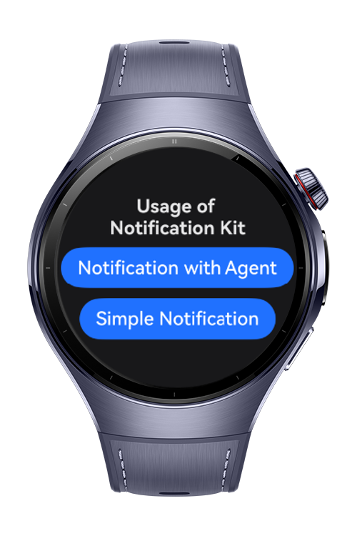

> **Note:** To access all shared projects, get information about environment setup, and view other guides, please visit [Explore-In-HMOS-Wearable Index](https://github.com/Explore-In-HMOS-Wearable/hmos-index).

# How to use notification with WantAgent?

This codelab demonstrates how to create and display interactive notifications in HarmonyOS using WantAgent.
Notifications are an essential way to provide timely information and re-engage users. By attaching a WantAgent, you can let users tap the notification to open a specific page, trigger an action, or start a service.

# Preview

<div>


</div>

# Use Cases

- Tapping the daily notification launches the app and shows the word list using a WantAgent.

- Action buttons in the notification trigger specific actions, such as opening the word details view.

# Tech Stack
Languages: ArkTS (Ark TypeScript)

Frameworks: HarmonyOS SDK 5.1.0 (API Version 18)

Tools: DevEco Studio Version 5.1.0.842

Libraries & Kits:

- @kit.NotificationKit Used for creating and managing both actionable and passive notifications.

# Directory Structure
```
|---pages
|   |---Index.ets              # Entry point for routing and init logic

|---service
|   |---NotificationService.ets # Sends and manages notifications
```


# Constraints and Restrictions

## Supported Devices

- Huawei Watch 5
- Devices running HarmonyOS 5.1.0 (API 18) and above

# Licence

NotificationWithWantAgent is distributed under the terms of the MIT License
See the [LICENSE](./LICENSE) for more information.
